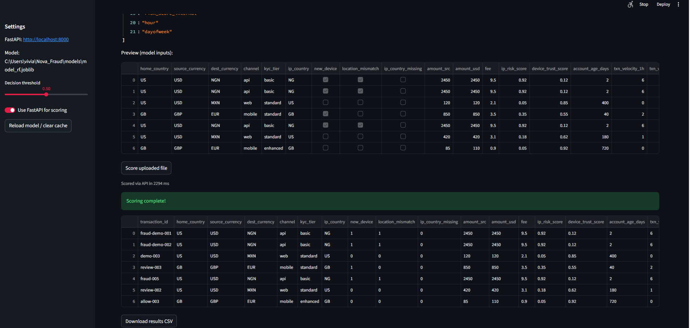
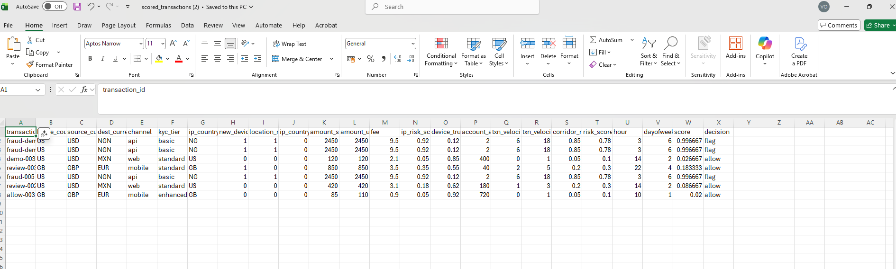

## FraudLens - Transaction Fraud Detection & Scoring
FraudLens is an end-to-end **fraud detection and decisioning system** that transforms
raw transaction data into **explainable, production-ready fraud scores**.

It combines machine learning models, SHAP-based interpretability, a FastAPI scoring
service, and an analyst-facing **Streamlit application (FraudLens UI)**.

## Project Overview
This project builds and deploys machine learning models to detect potentially fraudulent financial transactions.
It focuses not only on predictive performance, but also on interpretability, auditability, and real-world usability.

It spans the full fraud ML lifecycle — from feature engineering and modeling to deployment and decision support.

Key capabilities include:
Fraud-aware feature engineering
Robust model training with imbalance handling
Clear performance evaluation
SHAP-based explainability (local & global)
A local REST API for real-time scoring
An Interactive Streamlit web application

## FraudLens Demo

### Single Transaction Scoring

.png)

### Batch CSV Scoring




A sample CSV for batch scoring is available in:
`sample/sample_transactions.csv`


## Objectives
- Prepare a clean, consistent transaction dataset for fraud modeling and analytics
- Explore and visualize fraud patterns across channels, corridors, and time
- Train and evaluate strong baseline models (Logistic Regression and Random Forest) using time-aware validation
- Compare advanced models (XGBoost, LightGBM) with imbalance handling
- Generate reproducible metrics, plots, and artifacts
- Build a local API for real-time fraud scoring
- Provide explainability to turn model outputs into auditable decisions
- Enable analyst interaction via a Streamlit application


🗂️ Project Structure
```text
Nova_Fraud/
│
├── data/
│   └── Nova_pay_features.csv
│
├── notebooks/
│   ├── 01_Data_cleaning.ipynb
│   ├── 02_EDA.ipynb
│   ├── 03_train_baseline_model.ipynb
│   ├── 04_advanced_models.ipynb
│   ├── 05_model_summary_explainability.ipynb
│   └── 06_api_test.ipynb
│
├── models/
│   ├── model_log_reg.joblib
│   ├── model_rf.joblib
│   ├── model_xgb.joblib
│   └── model_lgbm.joblib
│
├── assets/
│   ├── confusion_matrices.png
│   ├── roc_pr_curves.png
│   ├── roc_curves.png
│   └── pr_curves.png
    ....
│
├── API/
│   ├── main.py
│   ├── requirements.txt
│
├── streamlit_app.py               # Streamlit Fraud Decision Console
├── .streamlit/
│   └── config.toml                # UI theme configuration
│
├── sample/
│   └── sample_transactions  
├── .gitignore
├── README.md
```

## Notebook Flow Overview
01_Data_cleaning: Prepare a clean, consistent transaction dataset
02_EDA: Analyze fraud patterns by channel, corridor, and time
03_train_baseline_model: Train Logistic Regression and Random Forest baselines
04_advanced_models: Train XGBoost and LightGBM with imbalance handling
05_model_summary_explainability: Compare models and explain predictions using SHAP
06_api_test: Test the FastAPI fraud scoring service locally

## Modeling Approach
Baseline Models
Logistic Regression (class-weighted)
Random Forest (balanced subsampling)

Advanced Models
XGBoost + Random Undersampling
LightGBM + Random Undersampling

Evaluation Metrics
Precision
Recall
F1-score
ROC-AUC
False Positive Rate
Confusion Matrix


Model selection prioritizes precision–recall trade-offs, reflecting real-world fraud costs.

## Explainability with SHAP
This project uses SHAP (SHapley Additive exPlanations) to interpret model decisions.
What SHAP Provides
- Local explanations: why a specific transaction was flagged
- Global explanations: which features drive fraud risk overall

This transforms the model from a black box into an auditable decision system.

## Fraud Scoring API
A local FastAPI service exposes the trained model for real-time scoring.
Start the API
cd API
uvicorn main:app --reload

Health Check
GET http://localhost:8000/health

Score Transactions
POST http://localhost:8000/score

```text
Sample Request
```text
 {
  "items": [
    {
      "transaction_id": "demo-1",
      "home_country": "US",
      "source_currency": "USD",
      "dest_currency": "MXN",
      "channel": "mobile",
      "kyc_tier": "standard",
      "ip_country": "US",
      "new_device": false,
      "location_mismatch": false,
      "ip_country_missing": false,
      "amount_src": 120.0,
      "amount_usd": 120.0,
      "fee": 2.1,
      "ip_risk_score": 0.2,
      "device_trust_score": 0.7,
      "account_age_days": 240,
      "txn_velocity_1h": 0,
      "txn_velocity_24h": 1,
      "corridor_risk": 0.05,
      "risk_score_internal": 0.2,
      "hour": 14,
      "dayofweek": 2
    }
  ]
}
```
Sample Response
```text
{
  "results": [
    {
      "transaction_id": "demo-1",
      "score": 0.0033333333333333335,
      "decision": "allow"
    }
  ]
}
```

## Streamlit Application — FraudLens

The project includes an interactive Streamlit web application that consumes the FastAPI service and supports analyst workflows.

### Key Capabilities
#### 🔹 Single Transaction Scoring
- Manually input transaction details
- Receive a fraud risk score and decision (ALLOW / FLAG)
- View local SHAP explanations for individual transactions
#### 🔹 Batch CSV Scoring
- Upload a CSV containing one or many transactions
- Score transactions in bulk via API or local model
- Download a results CSV with appended score and decision
- Preserves optional identifiers such as transaction_id
#### 🔹 Global Explainability
- Visualizes global SHAP feature importance
- Explains overall model behavior using a reference dataset
- Supports model governance and validation

### ▶️ Quick Start — Run FraudLens
#### 1. Clone the repo
git clone https://github.com/<your-username>/Nova_Fraud.git
cd Nova_Fraud

#### 2. Install dependencies
pip install -r requirements.txt
pip install -r API/requirements.txt

#### 3. Start the FastAPI service
cd API
uvicorn main:app --reload
API runs at:
http://localhost:8000

#### 4. Run the FraudLens UI
Open a new terminal and run:
cd ..
streamlit run streamlit_app.py
FraudLens opens at:
http://localhost:8501

## Key Takeaway
This project demonstrates how to move from raw transaction data to explainable, deployable fraud decisions, with a clear separation between:
- scoring services (FastAPI) and
- analyst interfaces (Streamlit).

## Tech Stack
Python, Pandas, NumPy
Scikit-learn, XGBoost, LightGBM
Imbalanced-learn
SHAP
FastAPI, Uvicorn
Streamlit
Matplotlib, Seaborn


